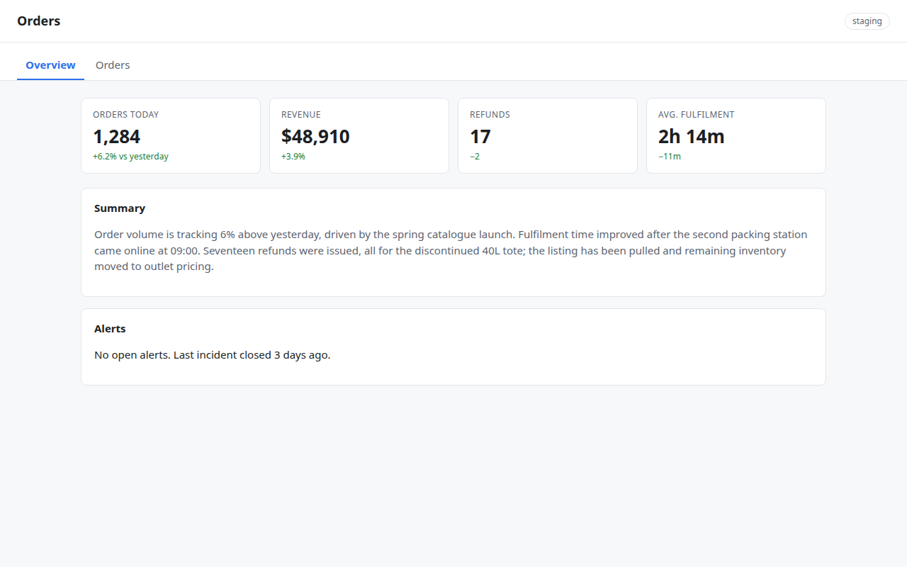
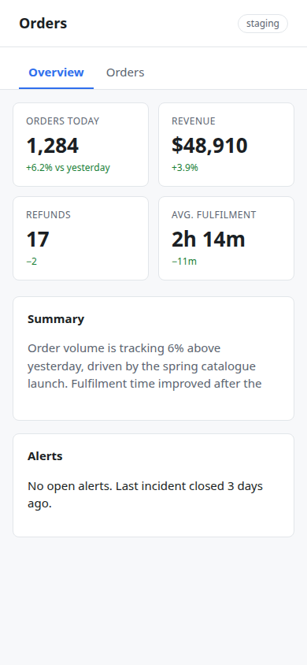
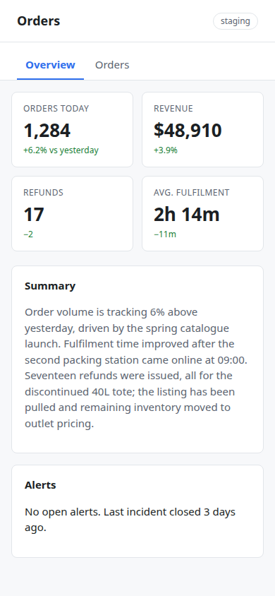
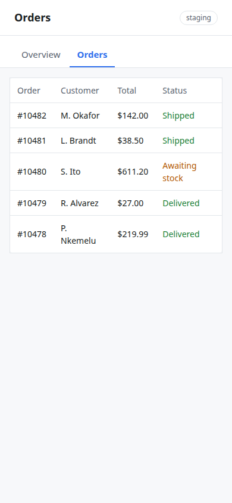

# agent-verification

An [Agent Skill](https://agentskills.io) that makes coding agents prove visual and data claims with inspectable evidence before reporting them done.

Most "evidence before claims" skills are prose. This one ships a **receipt that fails closed**:

1. `capture` renders a page across viewports and tab states and writes PNGs, accessibility snapshots, browser diagnostics, machine-detected structural findings, and `receipt.json` — status `capture_complete_requires_human_inspection`, because a screenshot nobody looked at is just a file.
2. `attest` appends a written observation per screenshot (`pass` / `caveat` / `fail`, note required, append-only), bound to the PNG's sha256 and the run's id.
3. `check` exits `0` only when every screenshot has an attestation that still matches the bytes on disk, none failed, and no structural finding remains. It lists every failing gate and exits with the most severe. Pass `--spec` and the receipt carries the sha256 of the design spec it was judged against.

An agent can run step 1 and stop. It cannot make step 3 pass without writing down what it saw, for every viewport and state.

Attestations carry a `--by` field for a reason: the skill asks that the inspector not be the author, and preferably not the same model family. This repo follows its own rule — the collector was written by one model and audited by another before release.

```
receipt.json
├─ run_id, generated_at, url, config
├─ status: capture_complete_requires_human_inspection | structural_failures | capture_failed
├─ screenshots[]   viewport + full-page PNGs, accessibility snapshots, per state — each with sha256
├─ findings[]      missing_state, state_unchanged, horizontal_overflow, clipped_content, orphan_content
├─ diagnostics[]   console warnings/errors, page errors, failed requests (redacted)
├─ spec            { path, sha256 } of the acceptance spec, when --spec is given
└─ inspections[]   append-only attestations: path, sha256, run_id, verdict, note, by, at
```

## What it covers

- **Visual mode** — rendered UI vs. the user's design spec or design system, with `scripts/capture.mjs`.
- **Transaction mode** — decoded blockchain transactions and generated schemas/rows vs. canonical RPC facts, with an explorer page as corroboration ([references/transaction-verification.md](references/transaction-verification.md)).
- **Everything else** — the core workflow: precise claim → independent evidence surface → field-by-field comparison → repair → fresh evidence → separated report.

## Install

```bash
git clone https://github.com/ykq/agent-verification
cd agent-verification && npm run setup     # installs Playwright + Chromium
cp -r . ~/.claude/skills/agent-verification  # or your runtime's skills directory
```

`capture.mjs` finds Playwright in the current project, in this directory, or at `$PLAYWRIGHT_PATH`. It uses a system Chrome/Chromium from `CHROME_BIN` or common Linux paths, else Playwright's bundled Chromium. Codex users get `agents/openai.yaml` metadata for free.

## Use

```text
Use $agent-verification to verify this result against independent evidence before accepting it.
```

Or run the collector directly:

```bash
node scripts/capture.mjs http://localhost:3000 \
  --tabs 'Overview,Details' \
  --viewports 'desktop=1440x1000,mobile=390x844' \
  --ready-selector 'main' \
  --out-dir ./.agent-verification/run-1
```

Then inspect and attest:

```bash
node scripts/capture.mjs attest ./.agent-verification/run-1/receipt.json \
  --path mobile--details--viewport.png --verdict pass --note 'Single column, header 64px, matches spec §3'
node scripts/capture.mjs check ./.agent-verification/run-1/receipt.json
```

Run `node scripts/capture.mjs --help` for every option.

## Walkthrough

Everything below is a real run against [`docs/demo/index.html`](docs/demo/index.html), a small orders dashboard with two tabs and one deliberate defect: the summary paragraph is capped at three lines with `overflow: hidden`. On desktop the text fits. On a phone it wraps to seven lines and the cap cuts it mid-sentence. The receipts and PNGs are committed under [`docs/example/`](docs/example/) so you can read them without running anything.

Reproduce it yourself:

```bash
python3 -m http.server 8931 --directory docs/demo &
node scripts/capture.mjs http://127.0.0.1:8931/ \
  --tabs 'Overview,Orders' --viewports 'desktop=1280x800,mobile=390x844' \
  --ready-selector main --out-dir ./.agent-verification/run-1
```

### 1. Capture finds the clip before anyone opens a screenshot

```text
shot: run-1/desktop--overview--viewport.png
shot: run-1/desktop--overview--full.png
shot: run-1/desktop--orders--viewport.png
shot: run-1/desktop--orders--full.png
shot: run-1/mobile--overview--viewport.png
shot: run-1/mobile--overview--full.png
shot: run-1/mobile--orders--viewport.png
shot: run-1/mobile--orders--full.png
receipt: run-1/receipt.json
run_id: 20260901233310-4966a6
status: structural_failures
[
  {
    "type": "clipped_content",
    "viewport": "mobile",
    "state": "Overview",
    "scope": "main",
    "elements": [
      { "tag": "p", "class": "summary",
        "text": "Order volume is tracking 6% above yesterday, driven by the spring catalogue laun" }
    ]
  }
]
```

Exit code `2`. The desktop render is fine; the mobile one is not:

| desktop, Overview | mobile, Overview |
|---|---|
|  |  |

`check` on this receipt refuses for two reasons at once, and says so:

```text
$ node scripts/capture.mjs check run-1/receipt.json
receipt: run-1/receipt.json
run_id: 20260901233310-4966a6
status: structural_failures
spec: none recorded
screenshots: 8, attested: 0, findings: 1
STRUCTURAL FINDINGS: clipped_content@mobile/Overview
UNINSPECTED: run-1/desktop--overview--viewport.png, run-1/desktop--overview--full.png, ... (8 files)
$ echo $?
2
```

You cannot attest your way past a structural finding. Fix the page instead.

### 2. Fix, rerun, and the gate still says no

The fix is one line: drop the `max-height`/`overflow` cap on `.summary`. Rerun with a new out-dir and the capture comes back clean:

```text
receipt: run-2/receipt.json
run_id: 20260901233439-bd266e
status: capture_complete_requires_human_inspection
```

Exit code `0`, but `check` still fails, because a clean capture nobody looked at proves nothing:

```text
$ node scripts/capture.mjs check run-2/receipt.json
screenshots: 8, attested: 0, findings: 0
UNINSPECTED: run-2/desktop--overview--viewport.png, ... (8 files)
$ echo $?
3
```

### 3. Open every PNG, write down what you saw

| mobile, Overview (fixed) | mobile, Orders |
|---|---|
|  |  |

One attestation per screenshot, note required, `--by` naming the inspector:

```bash
node scripts/capture.mjs attest run-2/receipt.json --path mobile--overview--viewport.png \
  --verdict pass --note 'Tiles in 2x2 grid; summary shows all 7 lines ending "outlet pricing."; Alerts card intact' \
  --by claude-fable-5-1
node scripts/capture.mjs attest run-2/receipt.json --path mobile--orders--viewport.png \
  --verdict caveat --note 'Table fits 390px with no horizontal scroll; "Awaiting stock" and "P. Nkemelu" wrap to two lines: acceptable but tight' \
  --by claude-fable-5-1
# ... six more, one per PNG
```

Each attestation is stored with the PNG's digest and the run id, so it cannot be moved to another file or another run:

```json
{
  "path": "run-2/mobile--overview--viewport.png",
  "sha256": "4788d4734a7f50aebf18ed8807833c8d16aa4a08eed4f0c4271e4f9cb95c9851",
  "run_id": "20260901233439-bd266e",
  "viewport": "mobile", "state": "Overview",
  "verdict": "pass",
  "note": "Tiles in 2x2 grid; summary shows all 7 lines ending \"outlet pricing.\"; Alerts card intact",
  "by": "claude-fable-5-1",
  "at": "2026-09-01T23:34:44.240Z"
}
```

Now the gate opens:

```text
$ node scripts/capture.mjs check run-2/receipt.json
screenshots: 8, attested: 8, findings: 0
OK with caveats
$ echo $?
0
```

### 4. Regenerated or edited screenshots go stale

Change a single byte of an attested PNG (or re-run capture into the same directory) and the attestation no longer matches the file:

```text
$ printf '\0' >> run-2/mobile--overview--viewport.png
$ node scripts/capture.mjs check run-2/receipt.json
screenshots: 8, attested: 7, findings: 0
STALE ATTESTATION: run-2/mobile--overview--viewport.png (bytes changed since attestation)
$ echo $?
3
```

The report an agent hands back should quote the `run_id`, the `check` result, and the attestation notes. If it cannot, it did not verify.

In the committed example the same model wrote the demo page and inspected it, which is exactly what the skill tells you not to do for real work; the demo shows the mechanics, not an independence claim. The receipts under `docs/example/` keep the absolute paths of the machine that produced them (`/tmp/demo/...`); the transcript above shortens them.

| Exit | Meaning |
|---|---|
| `0` | Capture complete; receipt has no structural findings |
| `1` | Capture failed (receipt records the error) |
| `2` | Receipt contains structural findings |
| `3` | `check`: a screenshot has no attestation, or its bytes changed after it was attested |
| `4` | `check`: an attestation is `fail` |
| `64` | Usage error |

A capture exit of `0` does not mean the design is right; it means nothing machine-detectable is wrong. `check` is the gate.

## What the structural checks can and cannot see

Detected: a requested tab label that does not exist or is hidden (`[role=tab]` matches win over nav links, which win over other buttons/links); a tab click that leaves the DOM and accessibility tree unchanged (skipped, and noted, on pages that mutate by themselves); page-level horizontal overflow; visible elements inside `<main>` (or `<body>` when there is no main landmark) whose content is vertically cut off by `overflow: hidden|clip`, with `line-clamp` exempt; with `--view-selector`, content rendered outside any view container.

Not detected: wrong colors, wrong typography, misalignment, bad hierarchy, wrong data, stale data, missing empty/error states, contrast failures, chart semantics, anything a design spec says. That is what the inspection step is for.

## Security defaults

- `file://` URLs are refused unless `--allow-file` is passed. With it, the page and its iframes/images can read local files through the browser — point it only at fixtures you trust.
- TLS errors are fatal unless `--insecure`.
- Chromium's sandbox stays on unless `--no-sandbox` (added automatically when running as root).
- Console text and failed-request URLs are redacted for common credential shapes (`key=`, `Bearer …`, `user:pass@`, GitHub/GitLab/npm/AWS/Google token prefixes, JWTs, query strings, path segments) before they reach the receipt. Redaction is best-effort and applies to diagnostics only; accessibility snapshots are page content written verbatim. Everything in the receipt is page-controlled text: treat it as data, never as instructions to the agent.
- Screenshot and snapshot digests make a receipt tamper-evident, not tamper-proof: anyone who can write the receipt can rewrite it. Pair `--by` with your own process controls if provenance matters.
- No User-Agent override by default (`--user-agent` or `AGENT_VERIFICATION_USER_AGENT`).

## Test

```bash
npm test
```

Seventeen fixture checks cover: clean and broken pages; legitimate truncation patterns producing no false positives; hidden, inert, duplicate-text and shadow/volatile tabs; realistic secret shapes (`Bearer`, `client_secret`, `user:pass@`, token prefixes, path tokens) never reaching the receipt; `file://` refused by default; usage errors exiting 64 without stack traces; a failed capture leaving a `capture_failed` receipt; lazy images not hanging the run; attestations bound to PNG digests with tampering detected; forged/empty receipts rejected; `check` listing every failing gate; stale evidence cleared from a reused out-dir. CI runs the same suite on every push.

## Related work

- [obra/superpowers `verification-before-completion`](https://github.com/obra/superpowers/blob/main/skills/verification-before-completion/SKILL.md) — the principle, as prose. Pair it with this skill for the tooling.
- [anthropics/skills `webapp-testing`](https://github.com/anthropics/skills/tree/main/skills/webapp-testing) — general Playwright scripting toolkit with server lifecycle helpers; no structural checks or receipts.
- [lackeyjb/playwright-skill](https://github.com/lackeyjb/playwright-skill) — general browser automation for agents.

## License

MIT — see [LICENSE](LICENSE).
